# 📱 SelectSmart – Android Decision Support Application

An adaptive Android decision support application developed as a final-year Software Engineering project. SelectSmart helps users make informed technology purchasing decisions by combining product browsing, intelligent search, filtering, side-by-side comparison, adaptive recommendations and a simulated e-commerce experience.

---

## 📖 Overview

Choosing the right technology product can be overwhelming due to the large number of available devices and increasingly complex technical specifications. SelectSmart was developed to reduce information overload by providing users with a mobile decision support system that simplifies product discovery and comparison.

Rather than functioning as a traditional shopping application, SelectSmart analyses user interactions to deliver adaptive product recommendations, helping users discover products that better match their interests and browsing behaviour.

The application was developed using **Kotlin**, **XML**, **Android Studio**, **Firebase Authentication** and **Cloud Firestore**, following the **Model–View–ViewModel (MVVM)** architectural pattern to create a scalable and maintainable Android application.

---

# 🎯 Problem Statement

Modern e-commerce platforms often present hundreds of similar technology products with lengthy specification lists, making purchasing decisions increasingly difficult.

SelectSmart addresses this problem by combining powerful search, filtering, product comparison and adaptive recommendation features into a single Android application that assists users throughout their purchasing journey.

---

# ✨ Features

### Authentication

- User Registration
- Secure Login
- Password Reset
- Firebase Authentication

### Product Browsing

- Browse Products by Category
- Product Details
- Product Specifications
- Product Images

### Search & Filtering

- Keyword Search
- Category Filtering
- Brand Filtering
- Price Sorting
- Search History

### Decision Support

- Adaptive Product Recommendations
- User Interaction Tracking
- Side-by-Side Product Comparison

### Shopping Experience

- Shopping Cart
- Checkout
- Delivery Details
- Payment Processing
- Order Confirmation
- Order History

### User Features

- User Profile
- Address Management
- Inbox / Order Notifications

---

# 🧠 Adaptive Recommendation System

Unlike a traditional shopping application, SelectSmart continuously records user behaviour including:

- Viewed products
- Search history
- Product interactions
- Previous purchases

This information is stored within **Cloud Firestore** and used to adapt the recommendations presented to the user over time, creating a more personalised shopping experience.

---

# ⚖️ Product Comparison

Users can compare similar products side-by-side, allowing important specifications to be viewed together before making a purchasing decision.

The comparison feature improves usability by reducing the need to manually switch between multiple product pages.

---

# 🛠 Tech Stack

- Kotlin
- Android Studio
- XML
- Firebase Authentication
- Cloud Firestore
- MVVM Architecture
- Gradle
- Android Jetpack Components
- Git
- GitHub

---

# 📸 Application Screenshots

### Welcome Screen

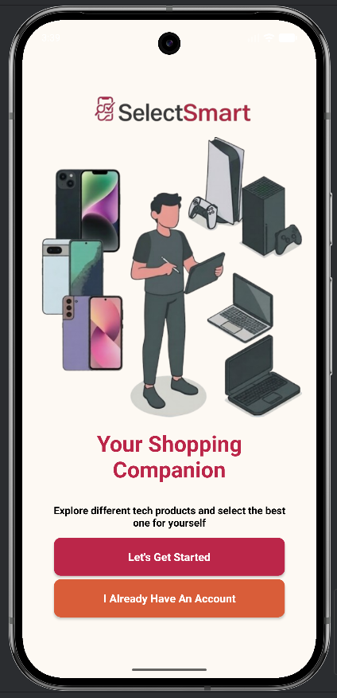

### Register Screen

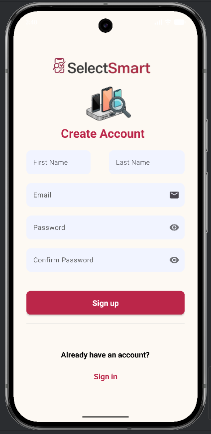

### Forgot Password Page

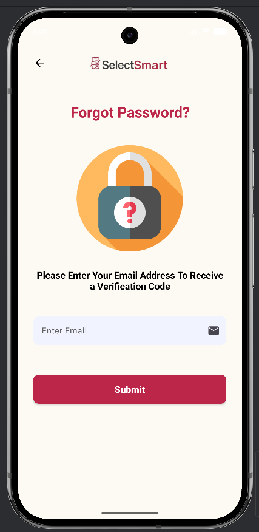

### Login Page

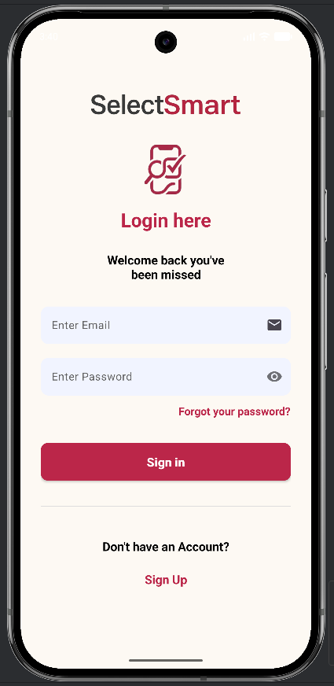

### Filter & Sort Product Page

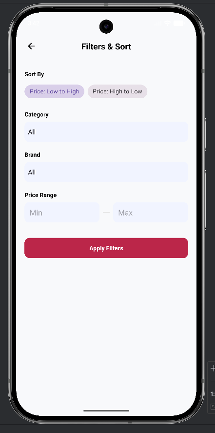

### Cart Page

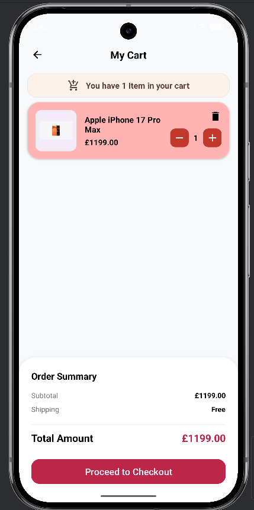

### Home Page

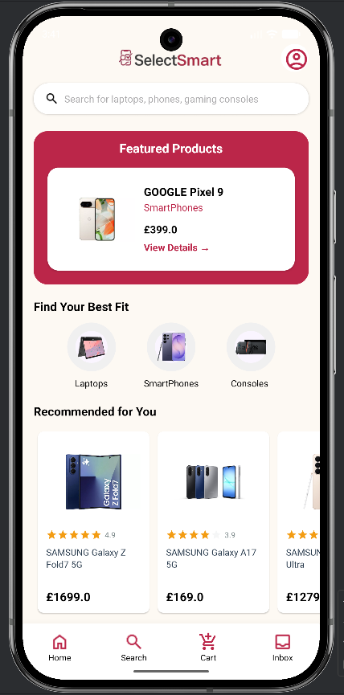

### Inbox Page

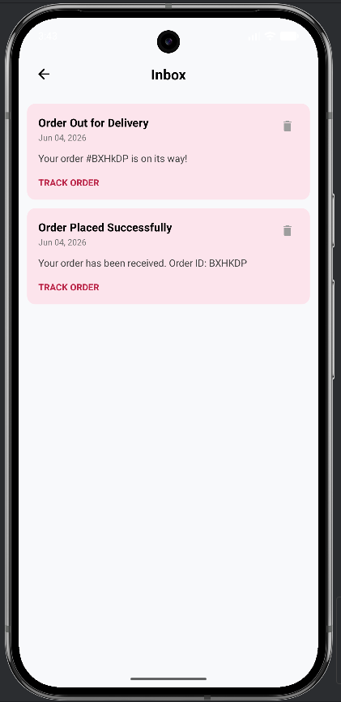

### Search Page

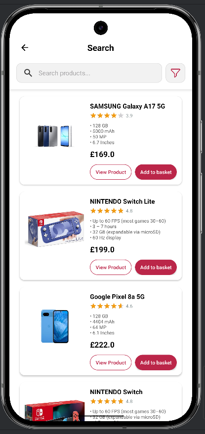

### Product List Page

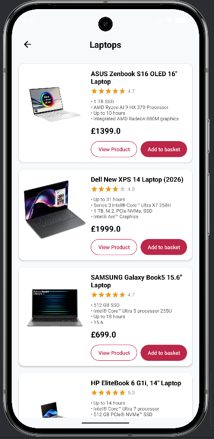

### Order Status Page

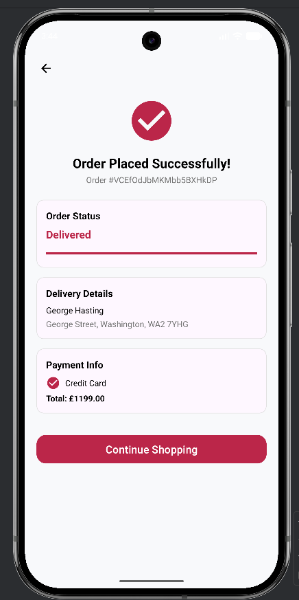

### Compare Product Page

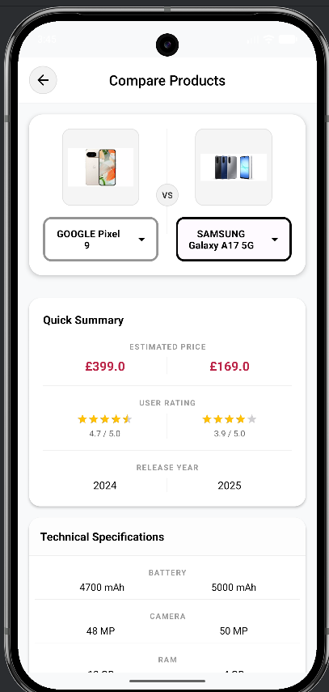

### Profile Page

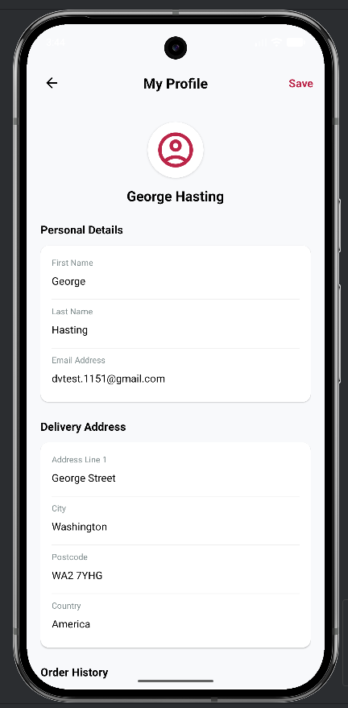

### Product Details Page

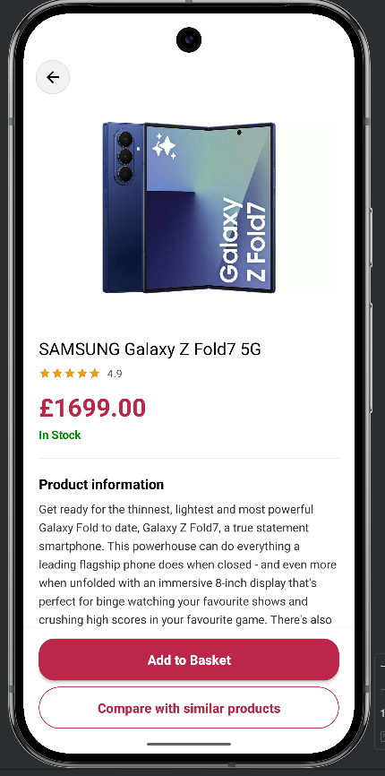

### Checkout Page

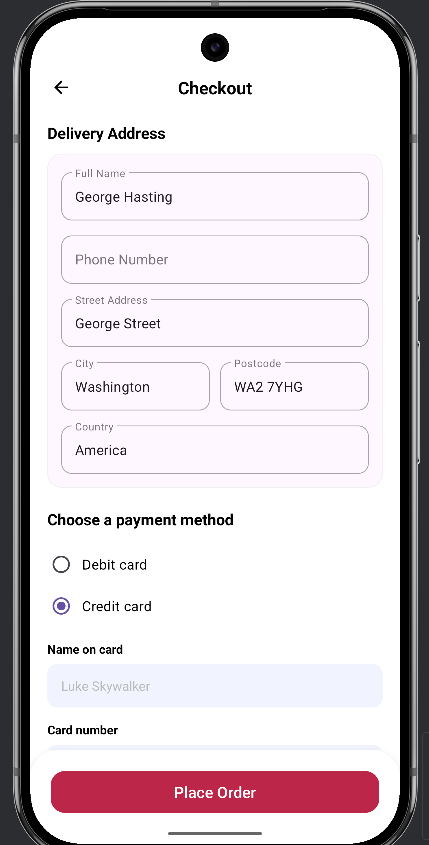

---

# ☁️ Firebase Integration

Firebase provides the backend services used throughout the application.

## Firebase Authentication

- User Registration
- Secure Login
- Password Reset

## Cloud Firestore Collections

- Users
- Products
- Categories
- Brands
- Cart
- Orders
- Order Items
- Payment
- Delivery
- Notifications
- Search History
- User Interactions

---

# 🔒 Firebase Security

Firebase Security Rules were implemented to protect user information and ensure authenticated users can only access their own application data.

Firebase / Firestore database evidence is included in the **firebase/** folder as documentation showing the collection structure and Firebase-related development evidence.

```text
firebase/selectsmart-application-database.odt
```

---

# 📂 Project Structure

```text
SelectSmart/
│
├── app/
│   ├── src/
│   │   ├── main/
│   │   │
│   │   ├── java/com/example/selectsmart_app/
│   │   │   ├── adapters/
│   │   │   ├── models/
│   │   │   ├── repositories/
│   │   │   ├── ui/
│   │   │   ├── viewmodels/
│   │   │   └── workers/
│   │   │
│   │   └── res/
│   │       ├── drawable/
│   │       ├── layout/
│   │       ├── menu/
│   │       ├── navigation/
│   │       └── values/
│   │
│   ├── google-services.example.json
│   └── build.gradle.kts
│
├── firebase/
│   └── selectsmart-application-database.odt
│   
│
├── screenshots/
├── gradle/
├── .gitignore
├── README.md
├── build.gradle.kts
├── settings.gradle.kts
├── gradlew
└── gradlew.bat
```

---

# 🏗 MVVM Architecture

SelectSmart follows the **Model–View–ViewModel (MVVM)** architecture.

**Model**

Contains the application's data models including:

- User
- Product
- CartItem
- Order
- OrderItem
- Payment
- Delivery
- UserInteraction

**View**

Implemented using XML layouts and Fragments including:

- Login
- Register
- Home
- Product List
- Product Details
- Compare Products
- Cart
- Checkout
- Profile
- Order History

**ViewModel**

Acts as the bridge between the UI and repositories by managing UI state and business logic.

**Repository**

Responsible for communicating with Firebase Authentication and Cloud Firestore while keeping data access separate from the UI.

This architecture improves scalability, maintainability and separation of concerns.

---

# ▶️ Running the Project

1. Open the project using Android Studio.
2. Allow Gradle to sync.
3. Create your own Firebase project.
4. Enable Firebase Authentication.
5. Enable Cloud Firestore.
6. Download your own `google-services.json`.
7. Place the file inside:

```text
app/google-services.json
```

8. Run the application on an Android emulator or Android device.

---

# 🔐 Firebase Configuration

For security reasons the original **google-services.json** file has been removed from this repository.

A template file is provided:

```text
app/google-services.example.json
```

To run the project, generate your own Firebase configuration file and replace the template with your own **google-services.json**.

---

# 📚 Programming Concepts Demonstrated

- Android Application Development
- Kotlin Programming
- MVVM Architecture
- Repository Pattern
- Firebase Authentication
- Cloud Firestore CRUD Operations
- User Interaction Tracking
- Adaptive Recommendation Systems
- Product Comparison Logic
- Search & Filtering
- RecyclerView
- LiveData
- ViewModel
- Navigation Component
- XML UI Design
- Material Design
- Agile Software Development

---

# 🎓 What I Learned

Throughout this project I gained practical experience in:

- Designing and developing a complete Android application
- Structuring applications using MVVM
- Integrating Firebase Authentication and Cloud Firestore
- Designing scalable NoSQL database structures
- Building adaptive recommendation functionality
- Implementing product comparison features
- Improving application usability through iterative testing
- Debugging Android applications and Firebase integration

---

# 📌 Notes

This application was developed as my final-year Software Engineering project at **De Montfort University**.

The repository contains the complete Android application source code together with application screenshots and Firebase documentation.

For security reasons, Firebase configuration files have been removed from the public repository.
